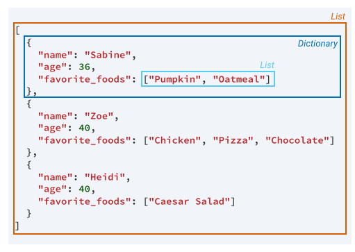

# APIs

API is the acronym for Application Programming Interface, which is a software intermediary that allows two applications to talk to each other. Each time you use an app like Facebook, send an instant message, or check the weather on your phone, you’re using an API.

```{r api-fig, fig.cap='How an API call works', out.width='80%', fig.asp=.75, fig.align='center', fig.alt='Figure showing how an API works.', echo=FALSE}
knitr::include_graphics("./images/api-request.svg")
```

## What is an API? 

When you use an application on your mobile phone, the application connects to the Internet and sends data to a server. The server then retrieves that data, interprets it, performs the necessary actions and sends it back to your phone. The application then interprets that data and presents you with the information you wanted in a readable way. This is what an API is - all of this happens via API.

To explain this better, let us take a familiar example.

Imagine you’re sitting at a table in a restaurant with a menu of choices to order from. The kitchen is the part of the “system” that will prepare your order. What is missing is the critical link to communicate your order to the kitchen and deliver your food back to your table. That’s where the waiter or API comes in. The waiter is the messenger – or API – that takes your request or order and tells the kitchen – the system – what to do. Then the waiter delivers the response back to you; in this case, it is the food.

## Working with JSON Data in Python

JSON (JavaScript Object Notation) is the language of APIs. JSON is a way to encode data structures that ensures that they are easily readable by machines. JSON is the primary format in which data is passed back and forth to APIs, and most API servers will send their responses in JSON format.

You might have noticed that the JSON output we received from the API looked like it contained Python dictionaries, lists, strings and integers. You can think of JSON as being a combination of these objects represented as strings. Let’s look at a simple example:

```{r json-fig, fig.cap='JSON Structure', out.width='80%', fig.asp=.75, fig.align='center', fig.alt='Figure showing JSON structure.', echo=FALSE}

```