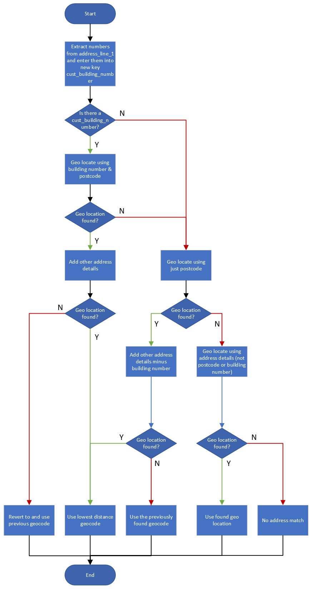

# Python Address Matching

## The Problem with Addresses 

It’s extremely common for people to make errors when inputting addresses, including formatting and misspelling mistakes. Traditional address matching is able to determine if an address is an exact match, but it does little to account for different formatting inputs and misspellings. Fuzzy logic address matching allows you to match and correct addresses that have been input incorrectly.

## Fuzzy Logic

Fuzzy logic address matching is a system that allows you to determine address accuracy with varying degrees of certainty (rather than simply determining whether an address exactly matches or not). This can be used for address matching and address standardization, enabling addresses to be automatically corrected.

Fuzzy logic address matching uses advanced algorithms (often AI-powered) to more accurately find and distinguish between addresses. This is ideal for identifying an address, as you can still find the correct address with a slightly incorrect search input.

Fuzzy logic is a form of determining degrees of value that fall between the standard “true or false” (0 or 1) distinctions present in Boolean logic. With fuzzy logic, you maintain the absolute truth values of 0 and 1, but allow for the use of any value of truth (partial truths) that falls between this. This can then be used to make determinations about the data, as well as flag certain pieces of data for correction.

## Fuzzy Logic in action

There are a number of issues with traditional address matching, as you need to have your data input exactly, including spelling and formatting. Fuzzy logic solves a number of problems that traditional address matching cannot:

- __Determine the likelihood of a full match__ - Rather than simply determining a full match, predict the likelihood of a full match, allowing you to make better decisions about matching data.
Address misspellings and small formatting errors - With traditional address matching, an address is either an exact match or not. With fuzzy logic, it determines the likelihood of a match, based on how many characters are different.

- __Difficult to deduplicate addresses__ - Without being able to easily pair addresses, it’s more difficult to deduplicate address data and combine your records.

- __Distinguishing unique address information__ - While you can program your exact matches to account for small differences in common formatting (i.e. street vs st, lane vs ln, avenue vs ave, etc.), this won’t account for street names and other unique address information that is not standard. Fuzzy logic allows you to set rules for address standardization, correcting address information like street names to match with better accuracy.

- __Impossible to identify phonetic variations__ - As simple address matching is looking for an exact match, they are not designed - and unable - to detect phonetic differences in addresses.

## Geocoding

Geocoding is the process of transforming a description of a location—such as a pair of coordinates, an address, or a name of a place—to a location on the earth's surface. You can geocode by entering one location description at a time or by providing many of them at once in a table. The resulting locations are output as geographic features with attributes, which can be used for mapping or spatial analysis.

You can quickly find various kinds of locations through geocoding. The types of locations that you can search for include points of interest or names from a gazetteer, like mountains, bridges, and stores; coordinates based on latitude and longitude or other reference systems, such as the Military Grid Reference System (MGRS) or the U.S. National Grid system; and addresses, which can come in a variety of styles and formats, including street intersections, house numbers with street names, and postal codes.

### What can geocoing be used for

From simple data analysis to business and customer management to distribution techniques, there is a wide range of applications for which geocoding can be used. With geocoded addresses, you can spatially display the address locations and recognize patterns within the information. This can be done by simply looking at the information or using some of the analysis tools available with ArcGIS. You can also display your address information based on certain parameters, allowing you to further analyze the information. A few of these applications are described in the sections that follow.

#### Address data analysis

With _geocoded addresses_, you can spatially display the address locations and begin to recognize patterns within the information. This can be done by simply looking at the information or by using some of the analysis tools available with ArcGIS. You can also display your address information based on certain parameters, allowing you to further analyze the information.

#### Customer data management

Geocoding acts as a crucial part of customer data management. Nearly every organization maintains address information for each customer or client. This is usually in tabular format, containing the customer name, address, buying habits, and any other information you have collected. Geocoding allows you to take your customers' information and create a map of their locations. Using a variety of related applications, you can use this information in many ways, from establishing marketing strategies to targeting specific clusters of customers to producing route maps and directions. The geocoded locations of your customers can be invaluable data.

```{r geolocation-fig, fig.cap='Geolocation Flow © Keiron Noble-Vickrage 2022', out.width='100%', fig.asp=.75, fig.align='center', fig.alt='Geolocation Flow', echo=FALSE}

```

