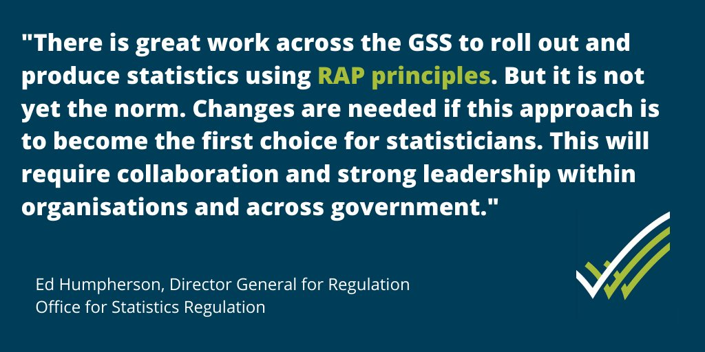
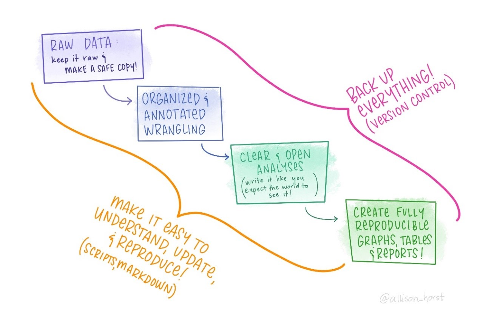

# Reproducible Analytical Pipeline (RAP)

## The Problem

Good quality evidence is key to making better decisions. Departments across government collect and analyse data for a wide variety of outputs. These outputs include official statistics, operational reports and predictive models for policy making.

Reproducible Analytical Pipelines (RAPs) are automated statistical and analytical processes. They incorporate elements of software engineering best practice to ensure that the pipelines are reproducible, auditable, efficient, and high quality.

RAPs increase the efficiency of statistical and analytical processes, delivering value. Reproducibility and auditability increase trust in the statistics. The pipelines are easier to quality assure than manual processes, leading to higher quality.

Statisticians and analysts should look to implement the RAP principles in parts of their processes.

(\#fig:rap-statement)Ed Humpherson, Office for Statistics Regulation

## A RAP will:

- improve the quality of the analysis
- increase trust in the analysis by producers, their managers and users
- create a more efficient process
- improve business continuity and knowledge management
- In order to achieve these benefits, at a minimum a RAP must:

    - minimise manual steps, for example copy-paste, point-click or drag-drop operations.     - Where it is absolutely necessary to include a manual step in the process this must be documented as described below
    - be built using open source software which is available to anyone, preferably R or python
    - deepen technical and quality assurance processes with peer review to ensure that the process is reproducible and that the below requirements have been met
    - guarantee an audit trail using version control software, preferably Git
    - be open to anyone – this can be facilitated most easily through the use of file and code sharing platforms
    - follow existing good practice for quality assurance – guidance set by departments or organisations, and by Best Practice and Impact and Data Quality Hub for the Analysis Function and Government Statistical Service
    - contain well-commented code and have documentation embedded and version controlled within the product, rather than saved elsewhere

## What RAP does
RAP borrows ideas from software development and academia to automate time-consuming processes of data assembly, verification and integration, generation of charts and tables, and set up and populate statistical reports. There are potential efficiency savings for analysts, freeing them up to focus on the interpretation of the results – turning four steps into one using a file format that allows intermingling of code and prose. This process effectively turns analysis into high quality documents, reports, presentation or dashboards that can be easily reproduced.

Data product production steps using Open Source programming languages such as R:

- Data store
- Rmarkdown
- Publish on GOV.UK

RAP reduces the number of stages in the statistical production process which saves time, money and also improving the quality assurance of publications by analysts. The main savings come from reduced time spent manually doing quality assurance of the process outlined in Figure 1. Instead, RAP enshrines business and statistical knowledge into code and documentation as part of a software package. However, there are also the costs of analysts learning an open source language which are factored into estimating the benefits from using this method.

(\#fig:rap-overview)How RAP works

## The nature of Reproducible Analytical Pipelines (RAP)
_by Shannan Child, Centre for Crime and Justice, Office for National Statistics_

Last year, the Centre for Crime and Justice (CCJ) started transformation plans to automate the most repetitive, resource intensive elements of the Crime Survey for England and Wales (CSEW) statistical pipeline. Our aim is to transform the way we produce our outputs and tables.

In March 2020 we kicked-off a collaborative project with the GSS Best Practice and Impact Team (BPI) to automate the production of our Nature of Crime tables.

Now, we are a week away from publishing those 100+ fully formatted tables, created through our R and Python reproducible analytical pipelines (RAP). We also plan to publish the code that sits behind them on our GitHub.

This is the first programming project of its kind for the CCJ, and certainly the first I have ever led. Reflecting on the last 6 months, this has been an incredible learning experience for myself and my team. We have learned so much about working with new coding tools, best practice, and the “spirit” of RAP.

Not only has this project developed our skill set but it has improved our production process. Our reliance on copying and pasting information between programs has been removed. This has improved the quality and readability of the tables, and opened opportunities for further transformation in the CCJ.

Some benefits are obvious, but some will only become apparent in time. We’ll have reduced what was a three-week sprint for 13 analysts in the team to a couple of hours for two members of the RAP team! This is a 1500-person hour saving. We also expect our new RAPs will reduce the number and nature of errors in table production and therefore reduce the number of revisions made to National Statistics. The project has increased the capability in the team. With this, we will roll-out RAP to our other outputs within the Centre.

I’m keen to share our learning and encourage you all to consider how you can also reap the benefits of RAP.

Ensure team has core knowledge about the coding tools
The programming skills of myself and my team when we started this project was incredibly wide-ranging. We had a few members who were proficient in using R or Python, some members who had attended training sessions and others with little to no experience at all. I was very lucky to have a team who were motivated and enthused to develop their skills and who picked up the important concepts as we progressed through development.

However, on reflection, we should have refreshed and supported the development of the teams’ core knowledge around functions, loops and data handling, all essential in RAP work, at the outset. There is so much to learn before you understand why you need to learn it, so if we had started with a strong and level foundation we may have progressed even faster!

“Just-in-time” learning is the best approach
As we progressed through the project we were inevitably presented with new concepts or tasks unfamiliar to us as a working group. We got into the habit of tackling these with bespoke just-in-time training sessions for the team. When it came to test parts of the code we had developed, we held a unit testing session, facilitated by the BPI Team.

The session covered what unit testing is, how to apply it and as a group we worked through an example. Following this we applied this learning in our own programming and table development. This approach worked as it was relevant training at the right time for us in the project. We had lots of sessions like this; when we needed to resolve merge conflicts in Git, complete peer reviewing and develop documentation.

Use GitLab little and often
Git is so important. I didn’t realise this until we started using it and it’s been a fantastic collaborative tool in this project. It was an additional learning curve for the team, but the benefits have outweighed all of that. We only started to get into the habit of using Git much later in our development process, despite having been introduced it very early on.

It’s a completely new way of working for us so it took some time for us to get to grips with it, but we got there. If we were to do this project again, I would push my team to use this to host their code from the first line they developed. I would also encourage them to get into the habit of committing to our repository much more frequently. When it came to quality assuring our pipeline, time elapsed between commits meant we had large chunks of code to check. This would have been a much more streamlined and manageable process had we used Git little and often from the start.

Embrace the unexpected
I had no idea how long each stage of this process would take my team. We worked in an iterative way. Milestones and deliverables had flexible timelines to begin with. We had regular catch-ups and reviews to identify what was working well, what wasn’t and where we needed more support or training.

I planned this project with three important outcomes in mind:

the publication of the tables
a “nature of crime” code repository
the development of my team’s skill set
I had a set idea of how we would get there, but the more we progressed the more I moved to embracing the unexpected. Some of our best personal and project development has come out of troubleshooting challenges or barriers which we didn’t expect to face. If I were to do this project again, I would still set out my key outcomes, but I would let the code, coding tool and innovation of my team drive how we get there from the start.

Continuous development is key
Whilst we are nearing publication day, there is still so much we would like to do with these tables and this code. We have identified areas in the code which we will change as we know more about RAP and are more confident in our skill set. This is only the start of our transformation journey in the Centre for Crime and Justice. We will continue to learn more about the methods and capability of our new programming languages.

We will roll out this learning and approach to more of our outputs going forward. As a team, we developed a future development log where over the last few weeks we have added ideas and potential RAP opportunities we would like to investigate following publication.

In the spirit of continuous development and transparency, we are also publishing our RAP code; we hope that we can share our learning and we are welcoming your feedback and suggestions on what we have developed so far.

If you would like more information or have questions on the work we’re currently doing within the CCJ to transform our processes, please email crimestatistics@ons.gov.uk.
